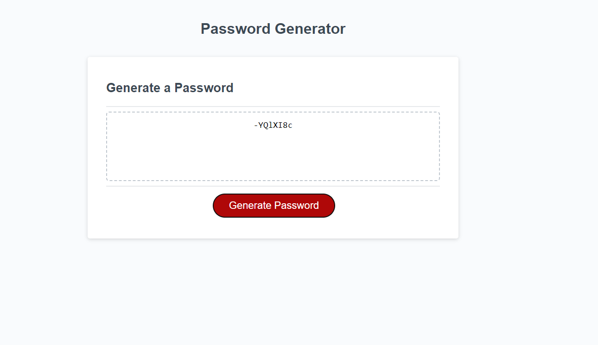

# HW-3-Password-Generator

## Description

In this project I set out to create a password generator. With the html and CSS provided, I worked exclusively in the javascript file to create the functionality. Using prompts the site asks for desired digit length and desired character set and generates a random string of characters based on those parameters to form a password.

Upon visiting the website, the user is presented with several prompts. Upon successfully completing the prompts the user can then proceed to the page where they can click a generate password button to create their password.

The website is accessible at https://dbanfieldkeller.github.io/HW-3-Password-Generator/

The website should resemble the below screenshot:

